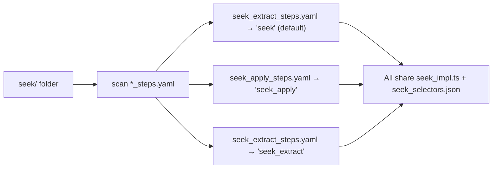

# Bot Folder Consolidation — Walkthrough

## What Changed

### Before: 6 folders, massive duplication
```
src/bots/
├── seek/          (impl + extract YAML + selectors + handlers + tests)
├── seek_apply/    (re-export impl + apply YAML + duplicate selectors)
├── seek_extract/  (re-export impl + identical YAML + duplicate selectors)
├── linkedin/      (impl + full YAML + selectors)
├── linkedin_apply/    (re-export impl + apply YAML + duplicate selectors)
└── linkedin_extract/  (re-export impl + extract YAML + duplicate selectors)
```

### After: 2 folders, zero duplication
```
src/bots/
├── seek/
│   ├── seek_impl.ts
│   ├── seek_extract_steps.yaml
│   ├── seek_apply_steps.yaml
│   ├── config/seek_selectors.json
│   ├── handlers/
│   └── tests/
└── linkedin/
    ├── linkedin_impl.ts
    ├── linkedin_steps.yaml
    ├── linkedin_apply_steps.yaml
    ├── linkedin_extract_steps.yaml
    └── linkedin_selectors.json
```

## Files Modified

| File | Change |
|---|---|
| [registry.ts](file:///home/wagle/inquisitive_mind/jobapps/questai/src/bots/core/registry.ts) | Rewrote to scan for all `*_steps.yaml` in each bot folder and register each as a first-class variant |
| `seek_apply/` | **Deleted** — was pure scaffolding |
| `seek_extract/` | **Deleted** — was byte-identical duplicate |
| `linkedin_apply/` | **Deleted** — was pure scaffolding |
| `linkedin_extract/` | **Deleted** — was pure scaffolding |
| [seek/seek_apply_steps.yaml](file:///home/wagle/inquisitive_mind/jobapps/questai/src/bots/seek/seek_apply_steps.yaml) | **Added** — moved from seek_apply/ |
| [linkedin/linkedin_apply_steps.yaml](file:///home/wagle/inquisitive_mind/jobapps/questai/src/bots/linkedin/linkedin_apply_steps.yaml) | **Added** — moved from linkedin_apply/ |
| [linkedin/linkedin_extract_steps.yaml](file:///home/wagle/inquisitive_mind/jobapps/questai/src/bots/linkedin/linkedin_extract_steps.yaml) | **Added** — moved from linkedin_extract/ |

## How Variant Discovery Works



Adding a new workflow is just dropping a YAML file:
```bash
# To add a new "seek_review" variant:
# 1. Create seek/seek_review_steps.yaml
# 2. Done — registry auto-discovers it as "seek_review"
```

## Verification Results

```
[Registry] Discovered bots: linkedin, linkedin_apply, linkedin_extract, seek, seek_apply, seek_extract

Bot: linkedin       → linkedin/linkedin_steps.yaml
Bot: linkedin_apply  → linkedin/linkedin_apply_steps.yaml
Bot: linkedin_extract → linkedin/linkedin_extract_steps.yaml
Bot: seek           → seek/seek_extract_steps.yaml
Bot: seek_apply      → seek/seek_apply_steps.yaml
Bot: seek_extract    → seek/seek_extract_steps.yaml

Available bots: linkedin, linkedin_apply, linkedin_extract, seek, seek_apply, seek_extract
```

All 6 variant names are discovered from 2 folders. Zero code changes needed in [bot_starter.ts](file:///home/wagle/inquisitive_mind/jobapps/questai/src/bots/bot_starter.ts) or the Rust backend.
